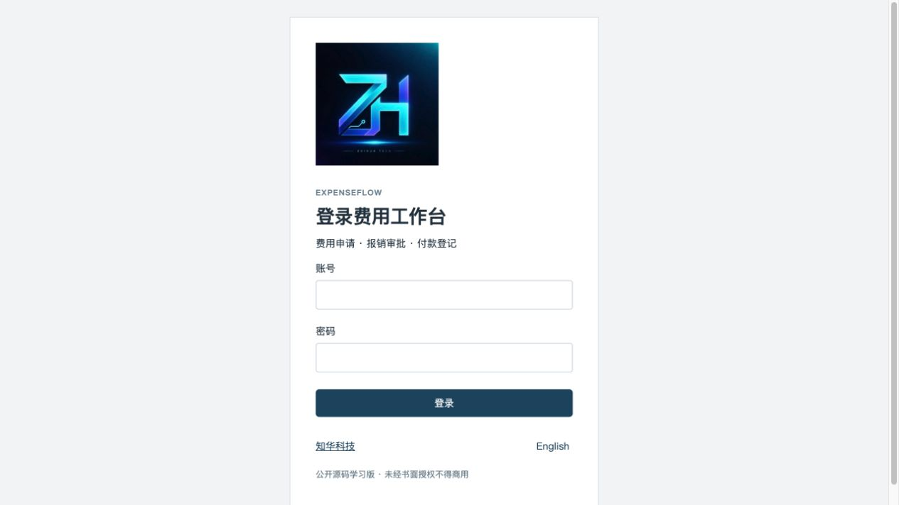
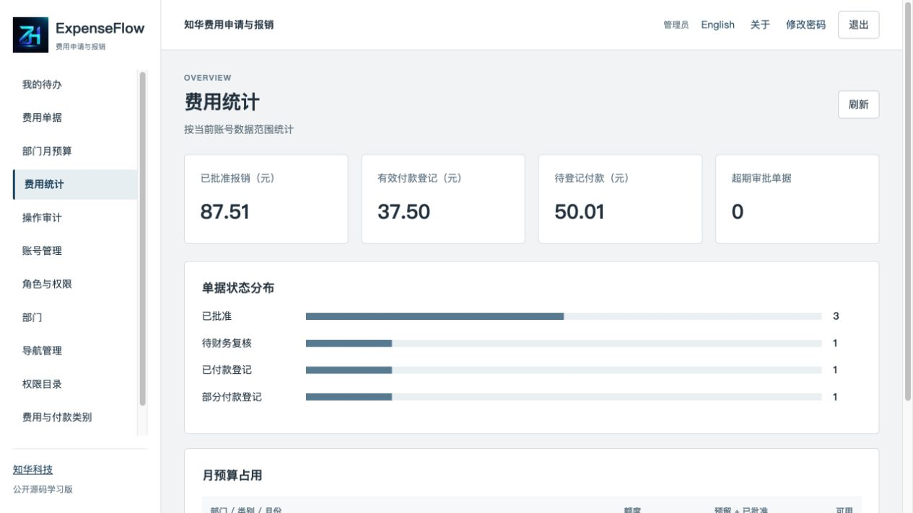
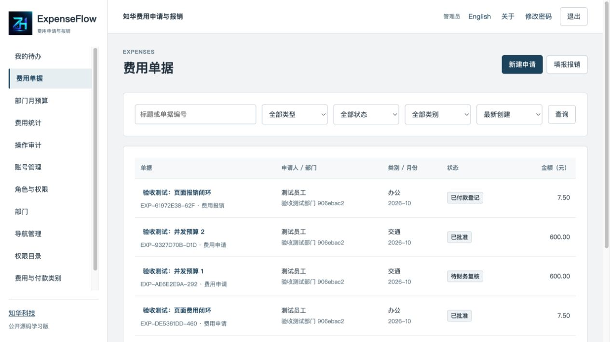
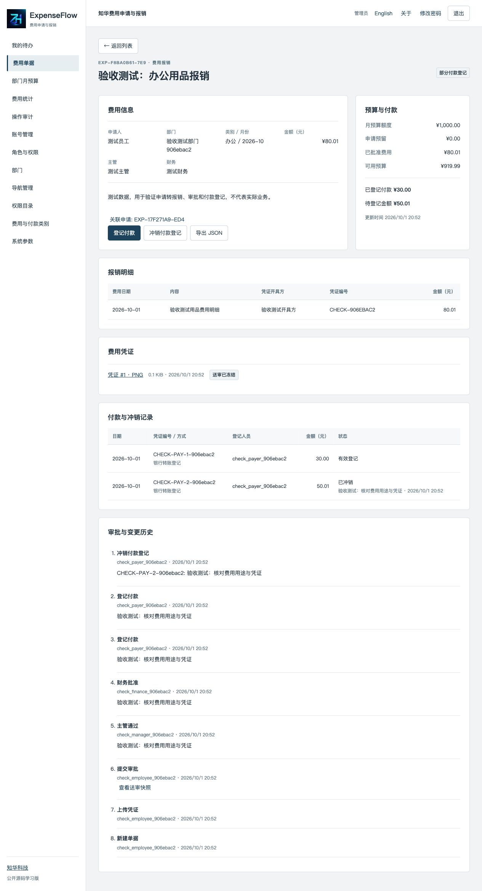
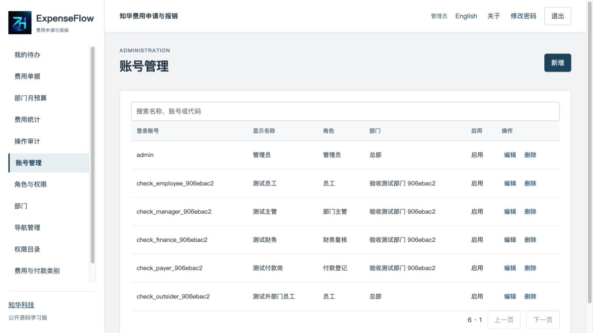
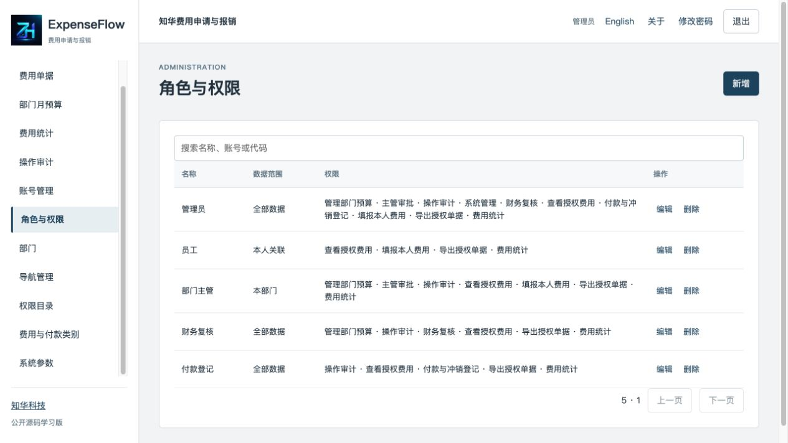

<p align="center"></p>

# ExpenseFlow · 企业费用申请与报销

**知华科技 · 上海如静知华信息科技有限公司**
[知华科技官网](https://www.zhuatech.cn/) · 公开源码学习版／非商业源码版

费用事前申请与事后报销往往分散在聊天、表格和纸质凭证中。ExpenseFlow 为员工、部门主管、财务复核及付款登记岗位提供同一套单据与审批记录，连接月预算预留、报销凭证和付款登记，减少重复填报与状态核对。

适合研究企业费用管理、岗位权限和审批系统的开发者，以及评估部门费用流程的团队。项目独立管理费用，不管理采购入库、库存、销售订单或生产工单。

## 从申请到付款登记

1. 管理员建立部门和账号；主管或财务配置部门、费用类别、月份的预算。
2. 员工建立费用申请，指定同部门主管和全范围财务人员。主管通过后，财务批准才预留预算。
3. 员工可由已批准申请创建一次关联报销，也可直接填报报销。报销金额由明细计算，送审前至少上传一份凭证。
4. 每次送审保存单据与明细快照、冻结现有凭证；主管或财务可退回补充，申请人可撤回待主管审批的单据。
5. 财务批准报销，将申请预留转为已批准费用，自动释放未使用差额。超预算需要明确确认并说明原因。
6. 独立付款岗位分次登记付款。冲销保留原记录和原因，重新计算待登记余额；付款和冲销不改变已批准费用占用。

**付款是人工记录，不执行银行转账。凭证编号由填报人录入，不执行发票认证。** 金额仅支持人民币，按整数分保存。

| 模块 | 当前实现 |
| --- | --- |
| 费用工作台 | 本人进行中单据、指定审批待办、待登记付款 |
| 费用单据 | 申请／报销创建、编辑、分页、搜索、状态／类别筛选、排序、JSON 导出 |
| 审批流转 | 主管审批、财务复核、退回、撤回、取消、申请关闭、版本冲突保护 |
| 月预算 | 部门＋类别＋月份额度、预留、已批准费用、可用余额、超预算确认 |
| 报销明细 | 1–20 条明细、日期与月份校验、开具方＋凭证编号防重复 |
| 凭证 | PNG／JPEG／PDF，单份 ≤5 MiB、每单 ≤20 份；授权下载、冻结留存 |
| 付款记录 | 分次登记、超额拦截、重复编号约束、冲销原因与原记录留存 |
| 统计与审计 | 授权范围内费用、付款、待付款、超期审批、预算占用、操作历史 |
| 系统管理 | 账号、角色、权限目录、菜单、部门、类别字典、系统参数；保护最后管理员 |
| 页面 | 中文／英文切换，桌面与手机布局；真实接口，无前端模拟模式 |

### 业务边界

- 一份申请最多关联一份报销；已取消的关联报销保留，不重复使用该申请链接。可关闭申请释放剩余预留。
- 同一单据只使用一种类别、一个月份。报销费用日期不得晚于系统时区的当天，且须属于该月。
- 草稿不占预算，凭证编号在送审时取得活动引用并校验重复；退回、撤回保留引用，取消释放活动编号。
- 已提交凭证不能删除。退回后可增加凭证，下一轮送审继续冻结；历史快照保留当轮明细。
- 已有付款的报销不能取消或编辑。冲销仅修正付款登记，不是退回报销或退款操作。
- 汇总与待办最多读取 10,000 条授权单据，超过时明确拒绝；单据列表使用数据库分页，单页最多 100 条。管理目录最多 10,000 条。
- 尚未实现多币种、OCR、税务票据认证、会计凭证、总账、实际支付、自动催办通知、电子签章、SSO、对象存储、附件恶意文件扫描。这些能力无演示伪装。
- 核心流程无需第三方账号；HTTPS 证书、域名、外部备份由部署方准备。票据认证或银行支付接入需另行开发及授权。

## 页面实景

以下为当前运行版本在独立验收数据库上的截图，页面中的“验收测试”记录是测试输入，不代表真实费用或客户案例。空库不会生成费用、预算或付款数据。

| 登录 | 费用统计 |
| --- | --- |
|  |  |

| 费用单据 | 报销详情与付款 |
| --- | --- |
|  |  |

| 账号管理 | 角色与权限 |
| --- | --- |
|  |  |

## 岗位与可见范围

| 初始角色 | 范围 | 操作 |
| --- | --- | --- |
| 管理员 | 全部 | 配置系统、预算、查看授权单据；审批仍须指定本人，不能代替指定审批人 |
| 员工 | 本人关联 | 填报本人费用，查看本人／本人指定审批相关单据 |
| 部门主管 | 本部门 | 填报本人费用、审批指定本人单据、维护本部门预算 |
| 财务复核 | 全部 | 指定本人财务审批、维护预算、查询费用 |
| 付款登记 | 全部 | 登记与冲销非本人报销付款 |

申请人、主管和财务必须是不同的启用账号。菜单、按钮与接口权限均校验；数据范围控制读写及凭证下载。管理员可设置角色权限组合，部署方应按实际职责授权。初始付款岗位与财务岗位分开，系统允许管理员按需配置组合角色，但付款登记人员不能是申请人。

员工在“我的待办”新建单据，在详情页上传凭证、送审、查看意见和原始快照。主管、财务及付款人员从待办打开详情操作。管理端维护启用账号、角色权限、部门、菜单显示及双语字典；内建权限／菜单／参数只支持编辑，不增加任意业务接口。

详见 [操作手册](docs/操作手册.md)。

## 架构与工程

浏览器 Vue 页面 → Nginx 同源入口 → Spring Boot REST 接口 → MySQL。Session 与 CSRF 由后端管理；Flyway 是数据库建表和升级的唯一入口，JPA 仅验证结构。费用、预算、审批事件、付款和凭证均持久化在 MySQL，凭证没有公开文件路径。

| 层 | 版本 |
| --- | --- |
| Java / Maven | Java 21 / Maven 3.9 |
| 后端 | Spring Boot 4.0.7、Spring Security、Hibernate、Flyway、MariaDB JDBC 驱动连接 MySQL |
| 前端 | Vue 3.5.40 / Vite 8.1.5 / Node.js 24.19.0 或更高版本 |
| 数据库 | MySQL 8.4（MySQL 8 系列） |
| 部署 | Docker Engine + Docker Compose v2 / Nginx 1.29 |
| 测试 | JUnit、Spring MockMvc、H2 MySQL 模式、Node test runner、真实 MySQL HTTP 验收 |

```text
backend/src/main/java/cn/zhuatech/expenseflow/  费用事务、权限与管理
backend/src/main/resources/db/migration/      版本化数据库脚本
backend/src/test/                            单元与接口集成测试
frontend/src/                                页面、接口、金额处理与测试
frontend/public/brand/                       正式 LOGO
frontend/public/third-party/                 第三方许可
scripts/                                     配置生成、HTTP 验收、发布检查
docs/                                        操作、接口、架构、部署、安全与截图
compose.yaml                                 三服务本地部署
.env.example                                 环境变量名称与安全默认配置
LICENSE                                      非商业源码许可
```

## 启动与配置

### Docker Compose

安装 Docker Engine 与 Compose v2，确认本机 `8101` 可用。Python 3 用于生成独立密码。

```sh
python3 scripts/init-env.py
docker compose config --quiet
docker compose up -d --build --wait
```

访问 **[http://127.0.0.1:8101](http://127.0.0.1:8101)**，健康检查 **[http://127.0.0.1:8101/actuator/health](http://127.0.0.1:8101/actuator/health)**。默认只绑定本机；数据库和后端不发布宿主端口。

首次空库账号为 `admin`。密码来自本地 `.env` 的 `ADMIN_PASSWORD`，没有公开默认密码；生成脚本不会显示密码，不覆盖已有配置。妥善读取该本地文件登录，随后通过页面修改密码。密码至少 12 位，含大写、小写、数字，UTF-8 最多 72 字节。现有账号密码不会被重启或新的环境变量覆盖。

| 变量 | 说明 |
| --- | --- |
| `DATABASE_PASSWORD` | 应用数据库密码，必填 |
| `MYSQL_ROOT_PASSWORD` | MySQL root 密码，必填 |
| `ADMIN_PASSWORD` | 仅空库初始化管理员密码，必填 |
| `WEB_PORT` | 前端宿主端口，默认 `8101` |
| `BIND_ADDRESS` | 默认 `127.0.0.1` |
| `COOKIE_SECURE` | 本机 HTTP 为 `false`；正式 HTTPS 设置 `true` |

端口占用时，在 `.env` 修改 `WEB_PORT`，或执行 `WEB_PORT=18101 docker compose up -d --wait`。不需要停止其他项目。停止服务用 `docker compose down`，不会删除数据库；`down -v` 会删除本项目卷，只有确认不需保留数据时使用。

### 开发运行

Java 21、Maven 3.9、Node 24.19+、Python 3 和独立 MySQL 8 数据库。先在 MySQL 中创建 `zhuatech_expenseflow` 并给专用账号最小必要权限。后端额外支持 `DATABASE_URL`、`DATABASE_USER`、`DATABASE_CATALOG`，仅用于开发连接或外部数据库；默认 Compose 内地址是 `mysql:3306`。

```sh
# 将独立开发密码通过环境变量提供，勿写入代码。
export DATABASE_URL='jdbc:mariadb://127.0.0.1:3306/zhuatech_expenseflow?connectionTimeZone=UTC&forceConnectionTimeZoneToSession=true&useMysqlMetadata=true&useCatalogTerm=CATALOG'
export DATABASE_USER=expenseflow
export DATABASE_CATALOG=zhuatech_expenseflow
# 设置 DATABASE_PASSWORD 与 ADMIN_PASSWORD 后运行：
cd backend
mvn spotless:check test spring-boot:run
```

另开终端：

```sh
cd frontend
npm ci
npm run dev
```

前端开发地址 [http://127.0.0.1:5173](http://127.0.0.1:5173)，开发代理指向后端 `8080`。安装版本及命令以工程锁文件为准。

## 数据、升级与部署

数据库脚本在 `backend/src/main/resources/db/migration/`：`V1__expenses.sql` 建立账号、权限及费用业务表；`V2__expense_indexes.sql` 增加权限外键与查询索引。启动自动迁移，再验证实体；通过 `flyway_schema_history` 核对版本和成功标记。已执行的迁移文件不修改，升级新增 V3、V4 等文件。

初始化仅生成总部、五类角色、权限目录、菜单、费用／付款字典、三个系统参数和管理员。**不自动生成业务数据，也不生成其他岗位账号或预算。** 管理员应先配置员工、主管、财务、付款岗位和月预算。

金额使用 bigint 整数分；单据乐观版本、数据库唯一约束及部门行锁保护同部门业务写入。预算批准、申请转报销、付款和审计在同一事务中保存。数据卷包含凭证原始内容，备份和恢复必须包含整库。

正式部署需书面商业授权，配置 HTTPS、限制运维权限、备份并演练恢复、评估附件扫描与容量。详细方法见 [部署指南](docs/部署指南.md)、[架构与数据](docs/架构与数据.md)、[安全说明](docs/安全说明.md)、[接口说明](docs/接口说明.md)。

## 测试与发布检查

```sh
cd backend
mvn spotless:check test
cd ../frontend
npm ci
npm run format:check
npm run lint
npm test
npm run build
cd ..
docker compose config --quiet
docker compose build
```

Docker 后端构建执行完整 `clean package` 与测试，不跳过测试。33 项后端测试（8 项单元、25 项接口集成）和 10 项前端测试涵盖精确金额、状态、权限、凭证、预算、幂等与并发付款。H2 接口测试不能代替真实 MySQL 验收。

使用全新、独立命名的 Compose 环境进行 HTTP 验收；**以下脚本会创建明确标注的测试账号、预算和费用，请勿在正式数据环境运行**：

```sh
docker compose -p expenseflow-check up -d --build --wait
python3 scripts/smoke.py
# 重启后验证持久化；应用会话在重启后需要重新登录。
docker compose -p expenseflow-check restart backend
python3 scripts/smoke.py --verify
python3 scripts/release-check.py
git diff --check
# 仅清理此次独立验收环境；删除该环境的测试数据。
docker compose -p expenseflow-check down -v
```

`smoke.py` 使用本地忽略的 `.env`，验收状态写在系统临时目录，包含测试账号密码，应在验收完成后删除。发布检查验证品牌、原始二维码和许可摘要、README 图片、六张截图及敏感内容模式；模式扫描不能保证发现所有敏感信息，发布前仍须人工审查差异。

### 常见问题

- 无法启动：检查 `.env` 必填密码和强密码要求；查看 `docker compose logs --tail=100 backend`，不要公开带敏感内容的日志。
- 不能选择主管／财务：确认账号启用、主管同部门、财务为全部范围并具有对应权限，三人不能重复。
- 送审提示缺预算：先为单据部门、类别和月份设置预算。草稿可保存，送审必须有预算。
- 重复凭证：开具方和编号经去空白、转大写后比对；检查其他未取消的单据。
- 记录已更新：刷新详情，重新核对后操作；不要重复改变同一请求幂等键的内容。
- 凭证上传失败：检查扩展名、文件头、大小及每单数量；Nginx 与后端均有限制。
- 改环境变量不改变旧密码：初始化只在空库发生，通过账号管理或修改密码页面维护。

## 安全与参与

会话 Cookie 为 HttpOnly / SameSite=Strict，写请求含 CSRF；账号停用、角色变化实时校验，密码修改撤销旧会话。登录失败按 IP 与账号限速；密码 BCrypt，不在页面、导出或日志主动输出。凭证下载校验单据范围及所属关系，强制附件下载，禁止缓存与内容嗅探。无匿名管理接口，不开启公开注册。

欢迎提交可复现问题、测试或小范围改进。提交前检查格式、测试、构建及差异，移除个人／客户数据和真实凭证。问题反馈可用仓库 Issues；安全漏洞不要在公开 Issues 中披露利用细节或账号数据，通过下方官方商业咨询入口联系。

学习版不构成会计、税务或付款合规保证。部署方负责业务核验、权限配置、数据保护与备份。许可见 [LICENSE](LICENSE)，第三方组件保留各自许可证，见 [第三方许可](frontend/public/third-party/NOTICES.txt)。

## 联系知华科技

本项目由知华科技（上海如静知华信息科技有限公司）提供公开源码学习版本，主要用于个人学习、技术研究与非商业交流。未经书面授权不得商用。企业信息化建设、中小企业数字化转型、中小企业 AI 转型、私有化部署、软件外包、软件项目外包、软件实施、FDE 外包、OPC 技术支持及深度定制开发，请访问[知华科技官网](https://www.zhuatech.cn/)，或添加微信 zhuatech、zhuatech2 咨询。

官网：[https://www.zhuatech.cn/](https://www.zhuatech.cn/)
商业授权、定制开发、部署与系统集成咨询微信：**zhuatech / zhuatech2**

| 微信 zhuatech | 微信 zhuatech2 |
| --- | --- |
|  |  |
